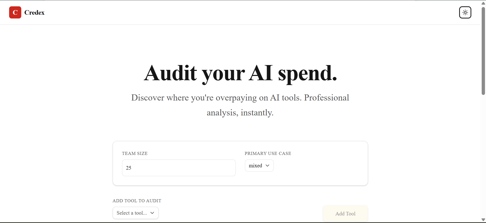
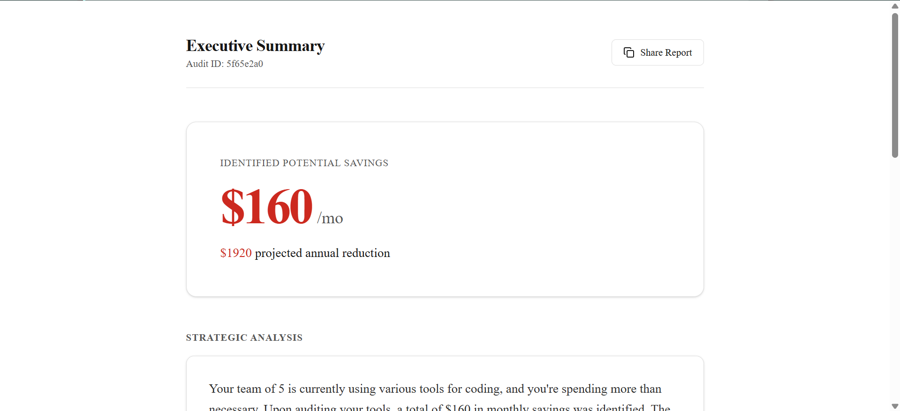
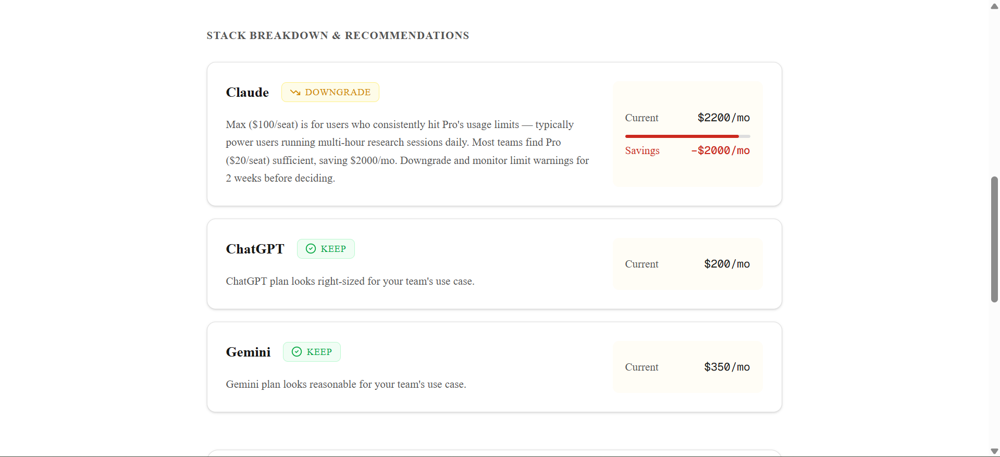

# AI Spend Audit

A free web app that audits your startup's AI tool spend and identifies
where you're overpaying — no account required, results in under 2 minutes.

Built as a lead-generation tool for [Credex](https://credex.rocks), which
sells discounted AI infrastructure credits.

## Screenshots




## Live URL

[https://credex-spend-audit-ten.vercel.app/](https://credex-spend-audit-ten.vercel.app/)

## Quick start

### Prerequisites
- Node.js 20+
- A Supabase project (free tier)
- A Groq API key (free at console.groq.com)
- A Resend API key (free tier)

### Install and run locally

\```bash
git clone https://github.com/suyash-jaiswal2/credex-spend-audit
cd credex-spend-audit
npm install
cp .env.example .env.local   # fill in your keys
npm run dev
\```

Open [http://localhost:3000](http://localhost:3000).

### Environment variables

| Variable | Where to get it |
|---|---|
| `NEXT_PUBLIC_SUPABASE_URL` | Supabase → Settings → API |
| `NEXT_PUBLIC_SUPABASE_ANON_KEY` | Supabase → Settings → API |
| `SUPABASE_SERVICE_ROLE_KEY` | Supabase → Settings → API |
| `GROQ_API_KEY` | console.groq.com |
| `RESEND_API_KEY` | resend.com |
| `RESEND_FROM_EMAIL` | Your verified Resend domain |
| `NEXT_PUBLIC_APP_URL` | Your deployed URL |

### Run tests

\```bash
npm test
\```

### Deploy

Push to `main` — Vercel auto-deploys. Make sure all env vars are set
in the Vercel dashboard before deploying.

## Decisions

1. **Groq over Anthropic API for the AI summary** — Groq's free tier has
   sufficient rate limits for a tool at this scale and llama-3.3-70b produces
   comparable output for a short summarisation task. Fallback to a templated
   string means users never see a broken state if Groq is down.

2. **Hardcoded rules in the audit engine, not AI** — The audit logic is
   deterministic price comparisons. Using an LLM here would introduce
   hallucinated prices and non-reproducible reasoning. A finance person
   should be able to read the rules and agree with them.

3. **Email captured after value is shown, never before** — Following the
   brief exactly, but also the right product decision. Asking for email
   before showing results would tank completion rates. The results page
   is the hook.

4. **Zustand with `persist` middleware over React state** — The form has
   8+ tools with multiple fields each. Losing that on a page refresh is
   a bad experience. Zustand's persist middleware adds one line and handles
   serialisation automatically.

5. **Server component for the shareable audit page** — The `/audit/:id`
   route is a Next.js server component so Open Graph meta tags are rendered
   server-side and Twitter/Slack unfurls work correctly. A client-only
   approach would have broken link previews.